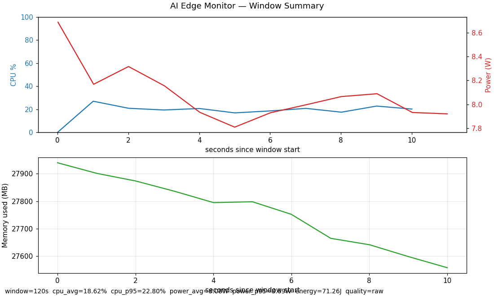
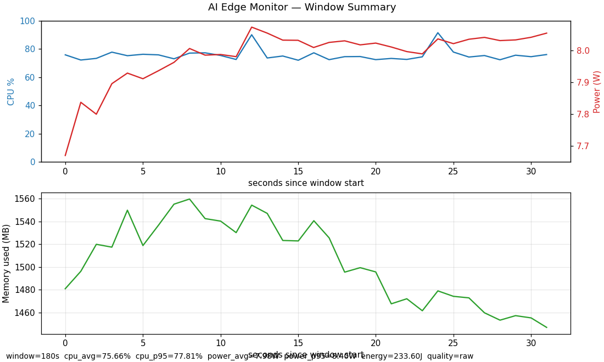
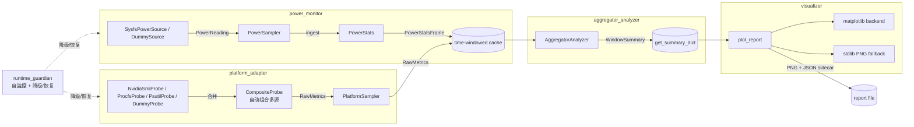

# ai-edge-monitor


> 面向 Jetson、Raspberry Pi、x86 边缘服务器的轻量级硬件监控管线，专为 AI 推理部署前后的性能评估设计。

`ai-edge-monitor` 把"采集 → 分析 → 报告"打通成一条独立、低开销、可旁路降级的链路：每个模块都自带基线测试与集成测试，关键路径在开发机上 30s × 100ms 空跑的 CPU 增量 < 0.05ms、RSS 增量 < 0.05MB。

## 实测输出

在 Windows x86 + NVIDIA GPU 机器上，`CompositeProbe` 自动组合 psutil 与 nvidia-smi，实时读取如下：

```text
Probe: CompositeProbe
CPU:  16.3%
Mem:  26638 / 32668 MB
GPU:  33.0%
GPU mem: 2169 MB
```

无需手动配置，`select_default_probe()` 会自动探测可用数据源并组合：
- **无 NVIDIA GPU** → `PsutilProbe`（或 `ProcfsProbe` on Linux）
- **有 NVIDIA GPU** → `CompositeProbe([PsutilProbe, NvidiaSmiProbe])`，CPU/内存与 GPU 指标同时采集

### 采集报告示例

**实时监控（10 秒采集，psutil + nvidia-smi）：**



**推理场景（60 秒合成负载）：**



## Quick Demo

```bash
pip install -e .
ai-edge-monitor run --duration 30
```

也可以用 YAML 配置文件运行：

```yaml
# monitor.yaml
duration_sec: 30
interval_ms: 1000
output_dir: reports/demo
device: auto
force_dummy: false
exporters:
  - jsonl
  - csv
  - summary
  - png
thresholds:
  cpu_high: 85
  temp_high: 80
```

```bash
ai-edge-monitor run --config monitor.yaml
```

默认输出到 `reports/demo/`：

```text
reports/demo/
├── metrics.jsonl   # 逐行 JSON 指标，适合日志管线和后处理
├── metrics.csv     # 表格化指标，适合 Excel / pandas 快速查看
├── summary.json    # 聚合分析结果，供报告和自动化检查复用
└── report.png      # 可视化报告；旁边同步生成 report.png.json sidecar
```

无真实硬件数据源时会自动降级到 dummy 源；也可以显式使用：

```bash
ai-edge-monitor run --duration 30 --force-dummy --out reports/demo
```

合成场景报告可用下面命令生成，示例报告路径为 `docs/test_report/scenarios/report_inference.png`：

```bash
ai-edge-monitor scenario --duration 60 --out docs/test_report/scenarios
```

## 核心特性

- **双路采集**：通用指标（CPU/内存/温度/GPU）走 `platform_adapter`，板级功耗走独立的 `power_monitor`，两路独立降频/熔断、互不阻塞
- **跨平台探测链**：`nvidia-smi → procfs → psutil → dummy` 自动选源；`sysfs power_supply → dummy` 同理；缺源时打 WARNING 而非崩溃；有 NVIDIA GPU 时自动组合 psutil + nvidia-smi 探测链，CPU/内存和 GPU 指标同时采集
- **非忙等定时**：所有采样器统一用 `time.monotonic()` + `sleep` 漂移补偿，绝不 spin
- **聚合层无重算**：`aggregator_analyzer` 直接消费 `PowerStatsFrame`，不重做窗口统计，避免与 `power_monitor` 双向漂移
- **零依赖回退**：`visualizer` 在没有 matplotlib 时用 stdlib `zlib` + 手写 PNG chunk 渲染合法报告 + JSON sidecar，CI 不需要装图形库
- **配置驱动编排**：`config_manager` 支持 YAML 默认值/文件/CLI 覆盖，`app_orchestrator` 统一装配采集、分析、导出和报告
- **Prometheus 指标暴露**：`prometheus_exporter` 可把窗口摘要转成 Prometheus text exposition，并可用 stdlib HTTP server 暴露 `/metrics`
- **容器化演示**：提供 `Dockerfile` / `docker-compose.yml`，方便隔离环境中跑 dummy 监控闭环
- **推理负载示例**：`examples/inference_demo.py` 用纯 Python 模拟持续推理负载，可与监控命令并行验证报告效果
- **场景驱动**：`src/scenarios/` 提供 idle / inference / throttled 三种合成负载，无真机也能预演分析能力

## 架构



完整设计与跨模块契约见 [docs/prd/README.md](docs/prd/README.md)。

## 快速开始

### 安装

```bash
git clone <repo-url> ai-edge-monitor
cd ai-edge-monitor

# 仅运行：核心库零依赖（除 Python 3.8+）
pip install -e .

# 推荐：带可选依赖（psutil 提供更全的温度采集，matplotlib 提供可读图表）
pip install -e ".[all]"

# 开发：再装 black / isort / mypy / pre-commit
pip install -e ".[dev]"
pre-commit install
```

可选依赖矩阵：

| extras | 包含 | 何时安装 |
|---|---|---|
| `[psutil]` | `psutil>=5.9` | 没有 `/proc` 的开发机 / Windows |
| `[viz]` | `matplotlib>=3.5` | 想要带坐标轴和注释的图表 |
| `[all]` | psutil + matplotlib | 推荐 |
| `[dev]` | 全部 + lint 工具 + pre-commit | 贡献者 |

### Docker 运行

```bash
docker build -t ai-edge-monitor:local .
mkdir -p reports
cat > monitor.yaml <<'YAML'
duration_sec: 30
interval_ms: 1000
output_dir: reports/docker_demo
force_dummy: true
exporters:
  - jsonl
  - csv
  - summary
  - png
thresholds:
  cpu_high: 85
  temp_high: 80
YAML
docker compose up --build ai-edge-monitor
```

### 结合推理 workload 运行

一个终端启动监控：

```bash
ai-edge-monitor run --duration 20 --out reports/inference_demo
```

另一个终端运行轻量推理负载：

```bash
python examples/inference_demo.py --duration-sec 20 --size 64
```

也可以生成合成推理场景报告：

```bash
ai-edge-monitor scenario --scenario inference --duration 60 --out docs/test_report/scenarios
```

### 运行端到端测试

```bash
# 30 秒，自动选源（真机走真实 sysfs/procfs，开发机降级到 dummy）
python integration/test_e2e_collect_to_report.py \
    --duration-sec 30 --interval-ms 1000 \
    --output-dir docs/test_report/artifacts

# 只跑短的烟雾测试（默认 10 秒，写到 integration/）
python integration/test_e2e_collect_to_report.py
```

输出（最后一行 JSON）：

```json
{
  "result": "PASS",
  "report_path": ".../test_report.png",
  "metrics_count": 32, "power_count": 33,
  "cpu_avg": 12.05, "power_avg_watt": 7.97,
  "energy_joule": 252.91,
  "render_backend": "stdlib",
  "failures": []
}
```

### 生成场景报告

```bash
# 三种合成负载（idle / inference / throttled），各 60 秒
python examples/generate_scenario_reports.py --duration-sec 60

# 输出到 docs/test_report/scenarios/
#   report_idle.png + .json
#   report_inference.png + .json
#   report_throttled.png + .json
#   scenario_summary.json
```

期望对比表（来自 [validation 报告](docs/test_report/real_hardware_validation.md) §A.7.3）：

```
scenario      cpu_avg  cpu_max  pwr_avg  pwr_max   energy temp_max
------------------------------------------------------------------
idle             5.02     5.99     1.98     2.15   122.52    38.79
inference       76.58    95.98     8.01     9.17   500.18    63.83
throttled       63.72    92.56     6.00     8.83   342.90    80.12
```

### CLI: 离线渲染报告

```bash
python -m visualizer --input summary.json --output report.png
```

## 模块状态

✅ 骨架 + 测试已落地  ·  🟡 PRD 已确立，未实现  ·  ⚪ 仅占位

```
+------------------------+--------+-------------------+----------------+-------------------+
| Module                 | Status | Baseline test     | Integration    | PRD               |
+------------------------+--------+-------------------+----------------+-------------------+
| cli                    |   ✅   | -                 | cli_run        | -                 |
| config_manager         |   ✅   | unittest          | cli_run        | docs/prd          |
| platform_adapter       |   ✅   | PASS (0.04 MB)    | adapter→coll   | docs/prd + nvidia |
| metrics_collector      |   ✅   | PASS (0.29 MB)    | coll→analyzer  | docs/prd          |
| power_monitor          |   ✅   | PASS (0.03 MB)    | power→analyzer | docs/prd/detailed |
| sampler_scheduler      |   ✅   | PASS (0.05 MB)    | scheduler→rep  | docs/prd          |
| aggregator_analyzer    |   ✅   | PASS (0.11 MB)    | e2e            | docs/prd          |
| storage_exporter       |   ✅   | unittest          | cli_run        | docs/prd          |
| prometheus_exporter    |   ✅   | unittest          | -              | -                 |
| visualization          |   ✅   | -                 | e2e            | docs/prd          |
| runtime_guardian       |   ✅   | PASS (0.04 MB)    | full_system    | docs/prd          |
| app_orchestrator       |   ✅   | unittest          | cli_run        | docs/prd          |
| scenarios (合成负载)   |   ✅   | -                 | examples       | -                 |
+------------------------+--------+-------------------+----------------+-------------------+
```

baseline 列的 MB 值是 30 秒 × 100ms 空跑的 RSS 增量上限实测（开发机 Windows + Python 3.12，无 psutil/matplotlib）。CPU 增量统一在 5ms 阈值之内（详见各 baseline 测试）。`integration/test_full_system.py` 是金本位：60 秒、collector + scheduler + guardian 联动、注入降级与恢复、所有 PNG/sidecar 校验。

## 项目结构

```
ai-edge-monitor/
├── Dockerfile                       # 容器化 demo 镜像
├── docker-compose.yml               # dummy 监控会话 compose 示例
├── .dockerignore                    # Docker 构建上下文排除
├── pyproject.toml                  # 包配置 + black/isort/mypy 配置
├── .pre-commit-config.yaml         # pre-commit 钩子
├── .github/workflows/
│   └── test.yml                    # CI: lint + matrix py3.8/3.10/3.12
├── src/
│   ├── cli/                        # ai-edge-monitor 主 CLI
│   │   └── __main__.py             # run / report / scenario 子命令
│   ├── config_manager/             # YAML 配置 + CLI 覆盖合并
│   │   └── config.py               # MonitorConfig / load_config
│   ├── app_orchestrator/           # 采集→分析→导出→报告编排
│   │   └── orchestrator.py         # Orchestrator + MonitoringResult
│   ├── platform_adapter/           # CPU/mem/temp/GPU 探针 + 采样器
│   │   ├── probe.py                # PlatformProbe ABC + DummyProbe
│   │   ├── procfs_probe.py         # /proc/stat + /proc/meminfo + thermal
│   │   ├── psutil_probe.py         # psutil 跨平台回退
│   │   ├── nvidia_smi_probe.py     # nvidia-smi GPU 利用率/显存/温度
│   │   └── sampler.py              # PlatformSampler (monotonic + sleep)
│   ├── power_monitor/              # 功耗采集 + 滑窗统计
│   │   ├── source.py               # PowerSource ABC + SysfsPowerSource + DummySource
│   │   ├── sampler.py              # PowerSampler
│   │   └── stats.py                # PowerStats / PowerStatsFrame
│   ├── collector/                  # 双路采集生命周期
│   │   └── collector.py            # Collector + CollectorConfig
│   ├── scheduler/                  # 周期调度
│   │   └── scheduler.py            # PeriodicScheduler + ScheduleConfig
│   ├── runtime_guardian/           # 自我看门狗
│   │   └── guardian.py             # RuntimeGuardian + GuardianConfig
│   ├── aggregator_analyzer/        # 跨源聚合
│   │   └── analyzer.py             # AggregatorAnalyzer + WindowSummary
│   ├── storage_exporter/           # JSONL / CSV / summary.json 导出
│   │   └── __init__.py             # JsonlExporter / CsvExporter / SummaryExporter
│   ├── prometheus_exporter/        # Prometheus text exposition + /metrics
│   │   ├── exporter.py             # PrometheusExporter
│   │   └── __init__.py
│   ├── visualizer/                 # 报告渲染
│   │   ├── report.py               # plot_report (matplotlib + stdlib 双后端)
│   │   └── __main__.py             # CLI: python -m visualizer
│   └── scenarios/                  # 合成负载（idle/inference/throttled）
├── tests/
│   ├── power_monitor/test_baseline.py
│   ├── platform_adapter/test_baseline.py
│   ├── aggregator_analyzer/test_baseline.py
│   ├── collector/test_baseline.py
│   ├── scheduler/test_baseline.py
│   ├── runtime_guardian/test_baseline.py
│   └── test_power_acceptance.py
├── integration/
│   ├── test_power_to_analyzer.py
│   ├── test_adapter_to_collector.py
│   ├── test_collector_to_analyzer.py
│   ├── test_scheduler_to_report.py
│   ├── test_e2e_collect_to_report.py
│   └── test_full_system.py            # 金本位: collector+scheduler+guardian
├── examples/
│   ├── generate_report.py          # 合成数据 → 示例报告
│   ├── generate_scenario_reports.py
│   └── inference_demo.py           # 轻量推理负载示例
├── tools/
│   └── power_acceptance.py         # 12 分钟真机验收脚本
└── docs/
    ├── prd/                        # 各模块 PRD
    ├── changelog/                  # 模块变更说明
    └── test_report/
        ├── real_hardware_validation.md   # 验收报告 + 真机操作手册
        ├── validation_template_jetson_rpi.md # Jetson/RPi 真机验收模板
        ├── artifacts/                    # e2e 30s 产物
        └── scenarios/                    # idle/inference/throttled 报告
```

## 测试与发布流程

每次提交 PR 自动触发 [`tests` workflow](.github/workflows/test.yml)：

1. **lint**: `pre-commit run` (black + isort + mypy on `src/`)
2. **tests** (Python 3.8 / 3.10 / 3.12 矩阵):
   - `tests/*/test_baseline.py` 6 个基线（每个 ~30-60s）
   - `tests/test_power_acceptance.py` (`unittest`)
   - 7 个 `integration/test_*.py`（含 `test_full_system.py` 60s 金本位和 `test_cli_run.py` CLI 闭环）
   - `examples/generate_report.py`
3. **artifacts**: PNG 报告 + JSON sidecar 上传，保留 14 天

本地等价命令：

```bash
pre-commit run --all-files
python tests/power_monitor/test_baseline.py
python tests/platform_adapter/test_baseline.py
python tests/aggregator_analyzer/test_baseline.py
python tests/collector/test_baseline.py
python tests/scheduler/test_baseline.py
python tests/runtime_guardian/test_baseline.py
python -m unittest discover -s tests -p "test_*.py" -t .
python integration/test_power_to_analyzer.py
python integration/test_adapter_to_collector.py
python integration/test_collector_to_analyzer.py
python integration/test_scheduler_to_report.py
python integration/test_e2e_collect_to_report.py --duration-sec 30
python integration/test_full_system.py
```

## 真机验收

`docs/test_report/real_hardware_validation.md` 同时包含开发机冒烟测试结果（已填）和真机操作手册（待填表）：上传项目（SCP/git）、设备端环境检查、跑基线 + 集成 + e2e、按 7 项 PASS 规则判定，覆盖 Jetson Nano / RPi 4B / x86 边缘三类设备。

## 许可

Proprietary（v0.1 内部分发）。许可条款待与下游对齐后追加。
