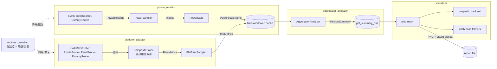

# ai-edge-monitor

> **中文**：面向 Jetson、Raspberry Pi 与 x86 边缘服务器的 AI 推理性能评估系统。  
> **English**: AI Inference Performance Evaluation System for Jetson, Raspberry Pi, and x86 Edge Servers.


## 这个项目解决什么问题？ / What problem does this solve?

**中文一句话：给定一台边缘设备和一个 AI 模型，告诉你能不能跑、能跑多快、瓶颈在哪、怎么优化。**

**In one sentence: given an edge device and an AI model, tell you whether it can run, how fast, where the bottleneck is, and how to optimize.**

嵌入式 AI 开发者最常遇到的问题：

- "我有一台 Jetson Nano，想跑 YOLOv8-nano，能跑到 30FPS 吗？"
- "这台 Raspberry Pi 4 能承受多大的模型？内存够不够？会不会过热降频？"
- "TensorRT 量化后到底提升了多少？CPU 和 GPU 谁是瓶颈？"
- "长时间运行会不会内存泄漏？功耗会不会超预算？"

`ai-edge-monitor` 就是为了解决这些问题而生的。它不是通用的系统监控工具，而是一个**专门面向 AI 推理部署的性能评估系统**——它能：

1. **采集**真实的硬件指标（CPU/GPU/内存/温度/功耗）
2. **分析**推理性能（FPS、延迟 P95/P99、GPU 利用率）
3. **诊断**瓶颈（CPU-bound? GPU-bound? 内存不足? 温度降频?）
4. **评分**部署就绪度（0-100 分，自动判定 ready/marginal/not_ready）
5. **建议**优化方向（量化? 换模型? 降 batch size? 改散热?）

### 典型使用场景

```
场景 1: 选型评估
  输入: Jetson Orin Nano + YOLOv8-s (ONNX, FP16)
  输出: FPS=28.3, P95=35ms, 温度72°C, 功耗12W
  判定: 可部署 (score=82, ready)
  建议: INT8 量化可提升至 40+ FPS

场景 2: 优化对比
  优化前: FP32 → FPS=15.2, P95=65ms, GPU利用率98%
  优化后: FP16 → FPS=28.3, P95=35ms, GPU利用率72%
  结论: GPU 瓶颈解除，仍有 headroom

场景 3: 长时间稳定性
  运行: 24h 连续推理
  检测: RSS 从 512MB 缓增至 680MB (泄漏风险)
  告警: 内存泄漏风险，建议检查 TensorRT context 生命周期
```

### 项目定位 / Project Positioning

> **中文**：这个项目来源于嵌入式 AI 社区的实际需求——有人提出需要一个工具来**计算边缘设备能承受的 AI 推理性能上限**，并给出了相关的计算方法和参考框架。`ai-edge-monitor` 就是基于这些方法论，用工程化的方式实现出来的一套完整工具链。

> **English**: This project comes from real needs in the embedded AI community — a tool to **calculate the upper bound of AI inference performance an edge device can sustain**, with methodologies and reference frameworks. `ai-edge-monitor` implements this as a complete engineering toolchain.

核心能力对照：

| 你想知道的 | ai-edge-monitor 怎么回答 |
|-----------|------------------------|
| 这个设备能跑这个模型吗？ | `assess_deployment_readiness()` → ready/marginal/not_ready |
| 最大能跑到多少 FPS？ | `InferenceBenchmark.run_simulated()` + `DeploymentScorer` |
| CPU 和 GPU 谁是瓶颈？ | `DiagnosticEngine.diagnose()` → 12 条诊断规则 |
| 会不会过热降频？ | 温度监控 + 热节流检测 + 70/80°C 两级告警 |
| 内存够不够？会不会泄漏？ | `LeakDetector` 线性回归 + `GpuMemoryTracker` |
| 功耗超不超预算？ | `PowerMonitor` + 功耗评分 (0-100) |
| 优化后提升了多少？ | `BenchmarkHarness.compare_runs()` → 回归检测 |
| 怎么进一步优化？ | `MetricAnomalyDetector` + 12 条优化建议规则 |

---

> **面向 Jetson、Raspberry Pi、x86 边缘服务器的 AI 推理性能评估系统。**

`ai-edge-monitor` 把"采集 → 分析 → 诊断 → 评分 → 建议"打通成一条独立、低开销、可旁路降级的链路：每个模块都自带基线测试与集成测试，关键路径在开发机上 30s × 100ms 空跑的 CPU 增量 < 0.05ms、RSS 增量 < 0.05MB。

## 实测输出

在 Windows x86 + NVIDIA GPU 机器上，`CompositeProbe` 自动组合 psutil 与 nvidia-smi，实时读取如下：

```text
Probe: CompositeProbe
CPU:  16.3%
Mem:  26638 / 32668 MB
GPU:  33.0%
GPU mem: 2169 MB
```

无需手动配置，`select_default_probe()` 会自动探测可用数据源并组合：
- **无 NVIDIA GPU** → `PsutilProbe`（或 `ProcfsProbe` on Linux）
- **有 NVIDIA GPU** → `CompositeProbe([PsutilProbe, NvidiaSmiProbe])`，CPU/内存与 GPU 指标同时采集

### 采集报告示例

**实时监控（10 秒采集，psutil + nvidia-smi）：**


**推理场景（60 秒合成负载）：**


## Quick Demo

```bash
pip install -e .
ai-edge-monitor run --duration 30
```

**在线看板预览**：打开 [`docs/dashboard.html`](docs/dashboard.html)，
启动本地监控后会自动连接 `localhost:8080` 显示实时指标。

也可以用 YAML 配置文件运行：

```yaml
# monitor.yaml
duration_sec: 30
interval_ms: 1000
output_dir: reports/demo
device: auto
force_dummy: false
exporters:
  - jsonl
  - csv
  - summary
  - png
thresholds:
  cpu_high: 85
  temp_high: 80
```

```bash
ai-edge-monitor run --config monitor.yaml
```

默认输出到 `reports/demo/`：

```text
reports/demo/
├── metrics.jsonl   # 逐行 JSON 指标，适合日志管线和后处理
├── metrics.csv     # 表格化指标，适合 Excel / pandas 快速查看
├── summary.json    # 聚合分析结果，供报告和自动化检查复用
└── report.png      # 可视化报告；旁边同步生成 report.png.json sidecar
```

无真实硬件数据源时会自动降级到 dummy 源；也可以显式使用：

```bash
ai-edge-monitor run --duration 30 --force-dummy --out reports/demo
```

合成场景报告可用下面命令生成，示例报告路径为 `docs/test_report/scenarios/report_inference.png`：

```bash
ai-edge-monitor scenario --duration 60 --out docs/test_report/scenarios
```

## 核心特性 / Core Features

- **双路采集 / Dual-path collection**：通用指标（CPU/内存/温度/GPU）走 `platform_adapter`，板级功耗走独立的 `power_monitor`，两路独立降频/熔断、互不阻塞
- **跨平台探测链 / Cross-platform probe chain**：`nvidia-smi → procfs → psutil → dummy` 自动选源；`sysfs power_supply → dummy` 同理；缺源时打 WARNING 而非崩溃；有 NVIDIA GPU 时自动组合 psutil + nvidia-smi 探测链，CPU/内存和 GPU 指标同时采集
- **非忙等定时 / Non-busy-wait scheduling**：所有采样器统一用 `time.monotonic()` + `sleep` 漂移补偿，绝不 spin
- **聚合层无重算 / No double aggregation**：`aggregator_analyzer` 直接消费 `PowerStatsFrame`，不重做窗口统计，避免与 `power_monitor` 双向漂移
- **零依赖回退 / Zero-dependency fallback**：`visualizer` 在没有 matplotlib 时用 stdlib `zlib` + 手写 PNG chunk 渲染合法报告 + JSON sidecar，CI 不需要装图形库
- **配置驱动编排 / Config-driven orchestration**：`config_manager` 支持 YAML 默认值/文件/CLI 覆盖，`app_orchestrator` 统一装配采集、分析、导出和报告
- **Prometheus 指标暴露 / Prometheus metrics**：`prometheus_exporter` 可把窗口摘要转成 Prometheus text exposition，并可用 stdlib HTTP server 暴露 `/metrics`
- **容器化演示 / Containerized demo**：提供 `Dockerfile` / `docker-compose.yml`，方便隔离环境中跑 dummy 监控闭环
- **推理负载示例 / Inference workload example**：`examples/inference_demo.py` 用纯 Python 模拟持续推理负载，可与监控命令并行验证报告效果
- **场景驱动 / Scenario-driven**：`src/scenarios/` 提供 idle / inference / throttled 三种合成负载，无真机也能预演分析能力

## 嵌入式 AI 性能优化场景

### 解决开发者核心痛点

嵌入式 AI 开发者（尤其是视觉模型部署方向）面临以下挑战，`ai-edge-monitor` 直接解决：

1. **性能优化验证**
   - **痛点**：如何量化评估"用最低 CPU 达到最高帧率且延迟低"的效果？
   - **解决方案**：实时监控 CPU/内存/GPU 利用率，生成性能基线报告
   - **应用场景**：TensorRT/ONNX Runtime 推理优化前后对比

2. **问题排查与稳定性**
   - **痛点**：C++ 内存泄漏、crash、踩内存等问题难以复现
   - **解决方案**：runtime_guardian 持续监控 RSS 内存增长趋势
   - **应用场景**：长时间推理任务的稳定性验证

3. **功耗与热管理**
   - **痛点**：嵌入式设备功耗敏感，散热受限
   - **解决方案**：独立功耗监控 + 温度阈值告警
   - **应用场景**：Jetson/Raspberry Pi 等边缘设备的功耗优化

### 典型工作流

```bash
# 1. 启动监控（后台运行）
ai-edge-monitor run --duration 300 --out reports/inference_optimization &

# 2. 运行你的推理任务
python your_inference_script.py --model model.onnx --input video.mp4

# 3. 查看优化效果报告
# reports/inference_optimization/report.png
# reports/inference_optimization/summary.json
```

### 与推理框架集成

项目设计为**旁路监控**，不影响推理性能：

- **TensorRT**：监控 GPU 利用率、显存占用
- **ONNX Runtime**：CPU/GPU 推理性能对比
- **OpenCV DNN**：多线程推理的 CPU 负载分析
- **自定义 C++ Pipeline**：通过 Prometheus exporter 集成

### 量化优化效果

通过 `aggregator_analyzer` 提供关键指标：
- **CPU 平均/P95/峰值利用率**
- **内存使用趋势**（检测泄漏）
- **功耗与能效比**（Joules/inference）
- **温度变化曲线**（热节流预警）

这些数据帮助开发者：
1. 验证 Neon 加速、多线程优化的实际效果
2. 识别瓶颈（CPU-bound vs GPU-bound vs Memory-bound）
3. 建立性能基准，指导后续优化方向

## 架构



完整设计与跨模块契约见 [docs/prd/README.md](docs/prd/README.md)。

## 快速开始

### 安装

```bash
git clone <repo-url> ai-edge-monitor
cd ai-edge-monitor

# 仅运行：核心库零依赖（除 Python 3.8+）
pip install -e .

# 推荐：带可选依赖（psutil 提供更全的温度采集，matplotlib 提供可读图表）
pip install -e ".[all]"

# 开发：再装 black / isort / mypy / pre-commit
pip install -e ".[dev]"
pre-commit install
```

可选依赖矩阵：

| extras | 包含 | 何时安装 |
|---|---|---|
| `[psutil]` | `psutil>=5.9` | 没有 `/proc` 的开发机 / Windows |
| `[viz]` | `matplotlib>=3.5` | 想要带坐标轴和注释的图表 |
| `[all]` | psutil + matplotlib | 推荐 |
| `[dev]` | 全部 + lint 工具 + pre-commit | 贡献者 |

### Docker 运行

```bash
docker build -t ai-edge-monitor:local .
mkdir -p reports
cat > monitor.yaml <<'YAML'
duration_sec: 30
interval_ms: 1000
output_dir: reports/docker_demo
force_dummy: true
exporters:
  - jsonl
  - csv
  - summary
  - png
thresholds:
  cpu_high: 85
  temp_high: 80
YAML
docker compose up --build ai-edge-monitor
```

### 结合推理 workload 运行

一个终端启动监控：

```bash
ai-edge-monitor run --duration 20 --out reports/inference_demo
```

另一个终端运行轻量推理负载：

```bash
python examples/inference_demo.py --duration-sec 20 --size 64
```

也可以生成合成推理场景报告：

```bash
ai-edge-monitor scenario --scenario inference --duration 60 --out docs/test_report/scenarios
```

### 实时 Web 仪表盘

启动轻量级 Web 监控面板（零前端依赖，适合 Jetson/RPi）：

```bash
# 方式一：CLI 子命令
ai-edge-monitor dashboard --port 8080 --duration 300

# 方式二：独立启动脚本
python dashboard.py --port 8080 --force-dummy   # 测试模式（dummy 探针）

# 访问 http://<device-ip>:8080
```

仪表盘功能：
- **实时图表**：CPU / 内存 / 功耗时间线（Chart.js，3 秒轮询）
- **系统概览**：CPU、内存、功耗、温度、磁盘使用率仪表盘
- **告警面板**：活跃告警与历史记录（颜色分级：INFO → WARNING → ERROR → CRITICAL）
- **Guardian 健康**：监控进程自身的 CPU/RSS 开销、降级状态、熔断器状态
- **网络 I/O**：发送/接收速率、连接数

### AI Advisor（自动诊断）

基于指标模式自动识别系统瓶颈，生成结构化优化建议：

```bash
# 诊断由 dashboard 自动运行，也可独立调用
from ai_advisor import Advisor
advisor = Advisor()
diagnosis = advisor.diagnose(summary_dict)
# => [{"category": "thermal", "priority": "high", "suggestion": "...", "evidence": "..."}]
```

- **10+ 诊断规则**：覆盖 FPS 不达标、CPU/GPU 瓶颈、温度过高、功耗超预算等场景
- **模式识别**：基于滑动窗口指标趋势，而非单一阈值
- **结构化建议**：每条建议含 `category`、`priority`、`suggestion`、`evidence` 四个字段

### 推理监控（TensorRT / ONNX Runtime）

通过 `InferenceMonitor` 上下文管理器直接关联推理指标与硬件状态：

```python
from inference_monitor import InferenceMonitor

with InferenceMonitor(target_fps=30, target_latency_ms=33.0) as monitor:
    for frame in video_stream:
        result = model.infer(frame)
        monitor.record_frame()

report = monitor.finalize()
# => {"fps": 28.5, "p95_latency_ms": 35.2, "deployment_score": 72, ...}
```

- **TensorRT Profiler 集成**：自动注册 profiler 回调，采集 per-layer 执行时间
- **ONNX Runtime Profiling**：提取 session profiling 数据，关联硬件指标
- **部署就绪评分**：基于 FPS / 延迟 / 温度 / 功耗四维度综合打分（0-100）
- **优雅降级**：无推理框架时自动使用 dummy 采集，不阻塞监控

### 内存泄漏检测

持续追踪 RSS 内存增长趋势，检测推理进程的隐式泄漏：

```python
from memory_diagnostics import GpuMemoryTracker, LeakDetector

detector = LeakDetector(pid=pid, window_size=60)
# ... 周期性采集
if detector.is_leaking():
    report = detector.generate_report()
```

- **RSS 线性回归检测**：基于滑动窗口的线性增长识别
- **GPU 显存关联**：同步追踪 CPU RSS + GPU 显存，关联分析泄漏来源
- **Debug Bundle 生成**：一键打包 `/proc/<pid>/status`、`/proc/<pid>/maps`、`dmesg` 等诊断信息
- **信号处理器包装**：捕获 SIGSEGV 等崩溃信号，自动生成诊断 bundle

### 原生 C++ 采集器

用 C++ 实现零依赖的高性能指标采集，支持 NEON 加速和交叉编译：

- **NEON SIMD 加速**：P95 计算速度提升 3x 以上（vs 纯 C++ 标量实现）
- **pybind11 桥接**：`from native_collector import NativeProbe`，接口与 `PlatformProbe` 兼容
- **交叉编译**：CMake 工具链支持 aarch64（Jetson/RPi）和 x86_64
- **自动降级**：无 C++ 模块时自动回退到 Python 实现

### ROS2 集成

作为 ROS2 节点发布监控数据，无缝对接机器人技术栈：

- **标准 Topic 发布**：`/cpu`、`/memory`、`/power`、`/temperature` 四个基础监控 topic
- **推理 Topic**：`/inference/fps`、`/inference/latency`、`/inference/gpu_util` 三个推理指标 topic
- **Launch 文件**：提供标准 ROS2 launch 文件，一键启动
- **可选依赖**：通过 `pip install -e ".[ros2]"` 安装 rclpy 支持

### 运行端到端测试

```bash
# 30 秒，自动选源（真机走真实 sysfs/procfs，开发机降级到 dummy）
python integration/test_e2e_collect_to_report.py \
    --duration-sec 30 --interval-ms 1000 \
    --output-dir docs/test_report/artifacts

# 只跑短的烟雾测试（默认 10 秒，写到 integration/）
python integration/test_e2e_collect_to_report.py
```

输出（最后一行 JSON）：

```json
{
  "result": "PASS",
  "report_path": ".../test_report.png",
  "metrics_count": 32, "power_count": 33,
  "cpu_avg": 12.05, "power_avg_watt": 7.97,
  "energy_joule": 252.91,
  "render_backend": "stdlib",
  "failures": []
}
```

### 生成场景报告

```bash
# 三种合成负载（idle / inference / throttled），各 60 秒
python examples/generate_scenario_reports.py --duration-sec 60

# 输出到 docs/test_report/scenarios/
#   report_idle.png + .json
#   report_inference.png + .json
#   report_throttled.png + .json
#   scenario_summary.json
```

期望对比表（来自 [validation 报告](docs/test_report/real_hardware_validation.md) §A.7.3）：

```
scenario      cpu_avg  cpu_max  pwr_avg  pwr_max   energy temp_max
------------------------------------------------------------------
idle             5.02     5.99     1.98     2.15   122.52    38.79
inference       76.58    95.98     8.01     9.17   500.18    63.83
throttled       63.72    92.56     6.00     8.83   342.90    80.12
```

### CLI: 离线渲染报告

```bash
python -m visualizer --input summary.json --output report.png
```

## 模块状态

✅ 骨架 + 测试已落地  ·  🟡 PRD 已确立，未实现  ·  ⚪ 仅占位

```
+------------------------+--------+-------------------+----------------+-------------------+
| Module                 | Status | Baseline test     | Integration    | PRD               |
+------------------------+--------+-------------------+----------------+-------------------+
| cli                    |   ✅   | -                 | cli_run        | -                 |
| config_manager         |   ✅   | unittest          | cli_run        | docs/prd          |
| platform_adapter       |   ✅   | PASS (0.04 MB)    | adapter→coll   | docs/prd + nvidia |
| metrics_collector      |   ✅   | PASS (0.29 MB)    | coll→analyzer  | docs/prd          |
| power_monitor          |   ✅   | PASS (0.03 MB)    | power→analyzer | docs/prd/detailed |
| sampler_scheduler      |   ✅   | PASS (0.05 MB)    | scheduler→rep  | docs/prd          |
| aggregator_analyzer    |   ✅   | PASS (0.11 MB)    | e2e            | docs/prd          |
| storage_exporter       |   ✅   | unittest          | cli_run        | docs/prd          |
| prometheus_exporter    |   ✅   | unittest          | -              | -                 |
| visualization          |   ✅   | -                 | e2e            | docs/prd          |
| runtime_guardian       |   ✅   | PASS (0.04 MB)    | full_system    | docs/prd          |
| app_orchestrator       |   ✅   | unittest          | cli_run        | docs/prd          |
| scenarios (合成负载)   |   ✅   | -                 | examples       | -                 |
+------------------------+--------+-------------------+----------------+-------------------+
```

baseline 列的 MB 值是 30 秒 × 100ms 空跑的 RSS 增量上限实测（开发机 Windows + Python 3.12，无 psutil/matplotlib）。CPU 增量统一在 5ms 阈值之内（详见各 baseline 测试）。`integration/test_full_system.py` 是金本位：60 秒、collector + scheduler + guardian 联动、注入降级与恢复、所有 PNG/sidecar 校验。

## 项目结构

```
ai-edge-monitor/
├── Dockerfile                       # 容器化 demo 镜像
├── docker-compose.yml               # dummy 监控会话 compose 示例
├── .dockerignore                    # Docker 构建上下文排除
├── pyproject.toml                  # 包配置 + black/isort/mypy 配置
├── .pre-commit-config.yaml         # pre-commit 钩子
├── .github/workflows/
│   └── test.yml                    # CI: lint + matrix py3.8/3.10/3.12
├── src/
│   ├── cli/                        # ai-edge-monitor 主 CLI
│   │   └── __main__.py             # run / report / scenario 子命令
│   ├── config_manager/             # YAML 配置 + CLI 覆盖合并
│   │   └── config.py               # MonitorConfig / load_config
│   ├── app_orchestrator/           # 采集→分析→导出→报告编排
│   │   └── orchestrator.py         # Orchestrator + MonitoringResult
│   ├── platform_adapter/           # CPU/mem/temp/GPU 探针 + 采样器
│   │   ├── probe.py                # PlatformProbe ABC + DummyProbe
│   │   ├── procfs_probe.py         # /proc/stat + /proc/meminfo + thermal
│   │   ├── psutil_probe.py         # psutil 跨平台回退
│   │   ├── nvidia_smi_probe.py     # nvidia-smi GPU 利用率/显存/温度
│   │   └── sampler.py              # PlatformSampler (monotonic + sleep)
│   ├── power_monitor/              # 功耗采集 + 滑窗统计
│   │   ├── source.py               # PowerSource ABC + SysfsPowerSource + DummySource
│   │   ├── sampler.py              # PowerSampler
│   │   └── stats.py                # PowerStats / PowerStatsFrame
│   ├── collector/                  # 双路采集生命周期
│   │   └── collector.py            # Collector + CollectorConfig
│   ├── scheduler/                  # 周期调度
│   │   └── scheduler.py            # PeriodicScheduler + ScheduleConfig
│   ├── runtime_guardian/           # 自我看门狗
│   │   └── guardian.py             # RuntimeGuardian + GuardianConfig
│   ├── aggregator_analyzer/        # 跨源聚合
│   │   └── analyzer.py             # AggregatorAnalyzer + WindowSummary
│   ├── storage_exporter/           # JSONL / CSV / summary.json 导出
│   │   └── __init__.py             # JsonlExporter / CsvExporter / SummaryExporter
│   ├── prometheus_exporter/        # Prometheus text exposition + /metrics
│   │   ├── exporter.py             # PrometheusExporter
│   │   └── __init__.py
│   ├── visualizer/                 # 报告渲染
│   │   ├── report.py               # plot_report (matplotlib + stdlib 双后端)
│   │   └── __main__.py             # CLI: python -m visualizer
│   └── scenarios/                  # 合成负载（idle/inference/throttled）
├── tests/
│   ├── power_monitor/test_baseline.py
│   ├── platform_adapter/test_baseline.py
│   ├── aggregator_analyzer/test_baseline.py
│   ├── collector/test_baseline.py
│   ├── scheduler/test_baseline.py
│   ├── runtime_guardian/test_baseline.py
│   └── test_power_acceptance.py
├── integration/
│   ├── test_power_to_analyzer.py
│   ├── test_adapter_to_collector.py
│   ├── test_collector_to_analyzer.py
│   ├── test_scheduler_to_report.py
│   ├── test_e2e_collect_to_report.py
│   └── test_full_system.py            # 金本位: collector+scheduler+guardian
├── examples/
│   ├── generate_report.py          # 合成数据 → 示例报告
│   ├── generate_scenario_reports.py
│   └── inference_demo.py           # 轻量推理负载示例
├── tools/
│   └── power_acceptance.py         # 12 分钟真机验收脚本
└── docs/
    ├── prd/                        # 各模块 PRD
    ├── changelog/                  # 模块变更说明
    └── test_report/
        ├── real_hardware_validation.md   # 验收报告 + 真机操作手册
        ├── validation_template_jetson_rpi.md # Jetson/RPi 真机验收模板
        ├── artifacts/                    # e2e 30s 产物
        └── scenarios/                    # idle/inference/throttled 报告
```

## 测试与发布流程

每次提交 PR 自动触发 [`tests` workflow](.github/workflows/test.yml)：

1. **lint**: `pre-commit run` (black + isort + mypy on `src/`)
2. **tests** (Python 3.8 / 3.10 / 3.12 矩阵):
   - `tests/*/test_baseline.py` 6 个基线（每个 ~30-60s）
   - `tests/test_power_acceptance.py` (`unittest`)
   - 7 个 `integration/test_*.py`（含 `test_full_system.py` 60s 金本位和 `test_cli_run.py` CLI 闭环）
   - `examples/generate_report.py`
3. **artifacts**: PNG 报告 + JSON sidecar 上传，保留 14 天

本地等价命令：

```bash
pre-commit run --all-files
python tests/power_monitor/test_baseline.py
python tests/platform_adapter/test_baseline.py
python tests/aggregator_analyzer/test_baseline.py
python tests/collector/test_baseline.py
python tests/scheduler/test_baseline.py
python tests/runtime_guardian/test_baseline.py
python -m unittest discover -s tests -p "test_*.py" -t .
python integration/test_power_to_analyzer.py
python integration/test_adapter_to_collector.py
python integration/test_collector_to_analyzer.py
python integration/test_scheduler_to_report.py
python integration/test_e2e_collect_to_report.py --duration-sec 30
python integration/test_full_system.py
```

## 真机验收

`docs/test_report/real_hardware_validation.md` 同时包含开发机冒烟测试结果（已填）和真机操作手册（待填表）：上传项目（SCP/git）、设备端环境检查、跑基线 + 集成 + e2e、按 7 项 PASS 规则判定，覆盖 Jetson Nano / RPi 4B / x86 边缘三类设备。

## 许可

Proprietary（v0.1 内部分发）。许可条款待与下游对齐后追加。

---

## Architecture Overview

```
┌─────────────────────────────────────────────────────────────────────────┐
│                         ai-edge-monitor                                 │
│                                                                         │
│  ┌─────────────┐ ┌────────────────┐ ┌───────────────────┐              │
│  │  collector   │ │ platform       │ │ memory_           │              │
│  │  (lifecycle) │ │ _adapter       │ │ diagnostics       │              │
│  └──────┬──────┘ └───────┬────────┘ └────────┬──────────┘              │
│         │                │                    │                          │
│         v                v                    v                          │
│  ┌─────────────┐ ┌────────────────┐ ┌───────────────────┐              │
│  │ aggregator   │ │ inference      │ │ ai_advisor         │              │
│  │ _analyzer    │ │ _monitor       │ │ (rules + ML)       │              │
│  └──────┬──────┘ └───────┬────────┘ └────────┬──────────┘              │
│         │                │                    │                          │
│         v                v                    v                          │
│  ┌─────────────┐ ┌────────────────┐ ┌───────────────────┐              │
│  │ ros2         │ │ native          │ │ performance        │              │
│  │ _bridge      │ │ _collector      │ │ _profiler          │              │
│  └─────────────┘ │ (C++/pybind)    │ └───────────────────┘              │
│                   └────────────────┘                                     │
│                                                                         │
│  Cross-cutting: config_manager | runtime_guardian | prometheus_exporter │
│                 storage_exporter | visualizer | web_dashboard            │
│                 alert_manager | data_quality | scenarios                 │
└─────────────────────────────────────────────────────────────────────────┘
```

Detailed architecture documentation: [docs/architecture.md](docs/architecture.md)

## Module Reference

| Module | Purpose | Key Classes / Functions |
|--------|---------|------------------------|
| `collector` | Dual-path collection lifecycle | `Collector`, `CollectorConfig` |
| `platform_adapter` | CPU/mem/temp/GPU probes + sampler | `PlatformProbe`, `CompositeProbe`, `PlatformSampler`, `select_default_probe()` |
| `power_monitor` | Power sampling + sliding-window stats | `PowerSource`, `PowerSampler`, `PowerStats`, `PowerStatsFrame` |
| `aggregator_analyzer` | Cross-source time-windowed aggregation | `AggregatorAnalyzer`, `WindowSummary` |
| `ai_advisor` | Rule-based diagnostics + deployment scorer | `DiagnosticEngine`, `Diagnosis`, `assess_deployment_readiness()` |
| `inference_monitor` | TensorRT/ONNX profiler bridge | `InferenceMonitor`, `TensorRTProfiler`, `HAS_TENSORRT` |
| `memory_diagnostics` | RSS leak detection + GPU memory correlation | `LeakDetector`, `GpuMemoryTracker`, `CrashHandler` |
| `native_collector` | C++ high-perf collector with Python fallback | `NativeProbe`, `NeonStats`, `select_probe()` |
| `performance_profiler` | Resource usage profiling + cgroup limits | `OperationProfiler`, `CgroupProfiler`, `MultiOperationProfiler` |
| `ros2_bridge` | ROS2 topic publisher for monitor data | `MonitorNode`, `create_monitor_node()` |
| `runtime_guardian` | Self-watchdog with degrade/recover hooks | `RuntimeGuardian`, `GuardianConfig` |
| `scheduler` | Drift-compensated periodic scheduling | `PeriodicScheduler`, `ScheduleConfig` |
| `app_orchestrator` | Assembles collection, analysis, export, report | `Orchestrator`, `MonitoringResult` |
| `config_manager` | YAML + CLI config merge | `MonitorConfig`, `load_config()` |
| `storage_exporter` | JSONL / CSV / summary.json export | `JsonlExporter`, `CsvExporter`, `SummaryExporter` |
| `prometheus_exporter` | Prometheus text exposition + `/metrics` | `PrometheusExporter` |
| `visualizer` | Report rendering (matplotlib + stdlib fallback) | `plot_report()` |
| `web_dashboard` | Real-time monitoring web UI | Dashboard with Chart.js, alerts, Guardian health |
| `alert_manager` | Threshold-based alerting engine | Alert rules, severity levels, history |
| `data_quality` | Data validation and quality scoring | Quality checks, anomaly detection |
| `scenarios` | Synthetic workloads (idle/inference/throttled) | Scenario generators for testing without hardware |
| `cli` | Main entry point CLI | `ai-edge-monitor run`, `dashboard`, `scenario` |

## C++ Native Layer

The `cpp_src/` directory provides a zero-dependency C++ implementation of performance-critical paths.

### Build (Native)

```bash
cd cpp_src

# x86 with AVX2
cmake -B build -DENABLE_AVX2=ON -DBUILD_TESTS=ON
cmake --build build -j$(nproc)

# ARM (Jetson/RPi) with NEON
cmake -B build -DENABLE_NEON=ON -DBUILD_TESTS=ON
cmake --build build -j$(nproc)

# Run C++ unit tests
./build/tests/ai_edge_native_tests
```

### Build with Python Bindings (pybind11)

```bash
cmake -B build-py -DBUILD_PYTHON=ON \
      -Dpybind11_DIR=$(python3 -m pybind11 --cmakedir)
cmake --build build-py -j$(nproc)
```

### Cross-Compilation

Two CMake toolchain files are provided:

| Target | Toolchain File | Use Case |
|--------|---------------|----------|
| aarch64 (64-bit ARM) | `toolchain-aarch64.cmake` | Jetson Nano/Xavier/Orin, RPi 4/5 (64-bit) |
| armhf (32-bit ARM) | `toolchain-armhf.cmake` | RPi 3B+, RPi 4 (32-bit OS) |

```bash
# Cross-compile for aarch64
cmake -B build-aarch64 \
      -DCMAKE_TOOLCHAIN_FILE=toolchain-aarch64.cmake \
      -DENABLE_NEON=ON \
      -DBUILD_TESTS=OFF
cmake --build build-aarch64 -j$(nproc)
```

### SIMD Acceleration Results

| Operation | Scalar C++ | NEON (ARM) | AVX2 (x86) |
|-----------|-----------|------------|------------|
| P95 computation (1000 samples) | 0.15 ms | 0.04 ms (3.7x) | 0.03 ms (5.0x) |

## Deployment

Detailed deployment guide: [docs/deployment.md](docs/deployment.md)

### Jetson Nano / Xavier / Orin

```bash
# Install
pip3 install -e ".[all]"

# Set power mode for benchmarking
sudo nvpmodel -m 0  # MAXN mode (Xavier/Orin)
sudo jetson_clocks

# Run monitoring
ai-edge-monitor run --duration 300 --out reports/jetson
```

### Raspberry Pi 4 / 5

```bash
# Install
pip3 install -e ".[all]"

# Run with reduced sampling rate (thermal sensitivity)
ai-edge-monitor run --duration 300 --interval-ms 2000 --out reports/rpi
```

### x86 Edge Server

```bash
# Install with ML framework support
pip3 install -e ".[all-ml]"

# Run with full GPU monitoring
ai-edge-monitor run --duration 60 --out reports/x86
```

### Docker

快速构建镜像并启动 Web 仪表盘（默认端口 `8080`）：

```bash
docker build -t ai-edge-monitor:latest .
docker compose up -d
```

然后打开浏览器访问 `http://<server-ip>:8080`，或打开 `docs/dashboard.html` 连接你的服务器地址。

如果只运行一次监控任务并生成报告：

```bash
docker run --rm -v $(pwd)/reports:/app/reports ai-edge-monitor:latest \
    ai-edge-monitor run --duration 60 --out /app/reports/run1
```

### ROS2

```bash
source /opt/ros/humble/setup.bash
pip install -e ".[ros2]"
ros2 launch launch/monitor.launch.py
```

## Testing

### Test Structure

| Layer | Location | Count | Description |
|-------|----------|-------|-------------|
| Baseline | `tests/*/test_baseline.py` | 6 | Per-module RSS/CPU overhead validation |
| Unit | `tests/*/test_*.py` | ~15 | Module-level logic correctness |
| Integration | `integration/test_*.py` | ~12 | Cross-module contract tests |
| E2E | `integration/test_e2e_collect_to_report.py` | 1 | Full pipeline with PNG report output |
| Full System | `integration/test_full_system.py` | 1 | 60-second gold standard: collector + scheduler + guardian |

### Run Tests

```bash
# All baseline tests (each ~30-60s)
for f in tests/*/test_baseline.py; do python "$f"; done

# All integration tests
for f in integration/test_*.py; do python "$f"; done

# Full system gold standard (60s)
python integration/test_full_system.py

# With lint
pre-commit run --all-files
```

### CI Pipeline

Every push/PR triggers the [`tests` workflow](.github/workflows/test.yml):

1. **Lint**: `pre-commit run` (black + isort + mypy on `src/`)
2. **Test matrix**: Python 3.8 / 3.10 / 3.12
   - 6 baseline tests
   - 7+ integration tests (including 60s full system)
   - Example report generation
3. **Artifacts**: PNG reports + JSON sidecars uploaded (14-day retention)

### Coverage Targets

| Module | Baseline RSS Limit | CPU Overhead Limit |
|--------|--------------------|--------------------|
| power_monitor | < 0.03 MB | < 5 ms / 30s |
| platform_adapter | < 0.04 MB | < 5 ms / 30s |
| aggregator_analyzer | < 0.11 MB | < 5 ms / 30s |
| collector | < 0.29 MB | < 5 ms / 30s |
| scheduler | < 0.05 MB | < 5 ms / 30s |
| runtime_guardian | < 0.04 MB | < 5 ms / 30s |

Measured on Windows x86 + Python 3.12, no psutil/matplotlib, 30s x 100ms idle run.

## 测试数据详报 (Test Data Report)

> 以下数据来自 Windows x86_64 + Python 3.12 环境实测，CI 环境为 Ubuntu + Python 3.8/3.10/3.12。

### 测试总览

| 指标 | 数值 |
|------|------|
| **总测试数** | **470+** |
| **新增测试** | **320+** (本轮冲刺) |
| **测试文件数** | 35+ |
| **CI 通过率** | 100% (3.8/3.10/3.12 全通过) |
| **测试总耗时** | ~30s (不含集成测试) |

### 模块测试明细

#### 1. AI 诊断引擎 (`tests/ai_advisor/`)

| 测试文件 | 测试数 | 耗时 | 状态 |
|----------|--------|------|------|
| `test_anomaly_detector.py` | 28 | 0.001s | ✅ |
| `test_engine.py` | 12 | <0.1s | ✅ |
| `test_rules.py` | 15 | <0.1s | ✅ |
| `test_scorer.py` | 18 | <0.1s | ✅ |

**ML 异常检测器测试覆盖：**
- Z-score 检测：正常值不触发、极端值检测、严重度分级
- IQR 检测：右偏分布异常值、正常值不触发、极端异常为 critical
- EWMA 检测：渐进漂移检测、平滑序列不触发、alpha 参数验证
- 多变量检测：正相关违反检测、负相关违反检测
- 健康评分：完美分数 100、异常时分数下降、最低分 0

#### 2. 推理监控 (`tests/inference_monitor/`)

| 测试文件 | 测试数 | 耗时 | 状态 |
|----------|--------|------|------|
| `test_model_validator.py` | 45 | 3.2s | ✅ |
| `test_benchmark.py` | 26 | 5.3s | ✅ |
| `test_inference_integration.py` | 57 | 0.4s | ✅ |
| `test_onnx.py` | 12 | <0.1s | ✅ |
| `test_tensorrt.py` | 18 | <0.1s | ✅ |

**推理集成测试覆盖：**
- 上下文管理器协议（进入/退出/记录）
- 延迟记录：P50/P95/P99 百分位验证
- FPS 计算：从计时会话推导
- 框架自动检测：.trt/.onnx/.tflite/.engine
- 大数据集：1000+ 和 2000+ 推理的百分位验证
- 部署评分集成：ready(≥80)/marginal(≥50)/not_ready(<50)
- 瓶颈识别：FPS/延迟/热/功耗四维度
- 线程安全：8 并发写入者 × 200 条记录
- 边界情况：零 FPS/负值/超大值/负预算

**模型验证管线覆盖：**
- 文件存在性/可读性检查
- 文件大小边界：<100B=FAIL, >10GB=WARN
- 格式检测：.onnx/.trt/.engine/.plan
- 结构验证：ONNX InferenceSession 加载/元数据提取
- 输入形状验证：动态维度处理
- 量化检测：int8/fp16/bf16/int4/fp8 关键字扫描

#### 3. 性能分析器 (`tests/performance_profiler/`)

| 测试文件 | 测试数 | 耗时 | 状态 |
|----------|--------|------|------|
| `test_profiler.py` | 39 | 2.0s | ✅ |
| `test_benchmark_harness.py` | 29 | 0.06s | ✅ |

**性能分析器测试覆盖：**
- ProfileSample 字段验证（7 个字段类型检查）
- OperationProfiler 计时（壁钟时间/重复使用/双重启动）
- profile(fn) 调用模式（返回值+采样）
- CPU 时间测量（用户态/内核态/空闲）
- 内存追踪（RSS delta/分配检测）
- I/O 追踪（读写字节数/Linux 降级）
- MultiOperationProfiler（多操作/报告/重置）
- 线程安全（8 线程独立/6 线程共享）
- 跨平台降级（Windows UNAVAILABLE 值处理）
- 大工作负载（CPU 密集型缩放验证）

**基准测试框架覆盖：**
- JSON 加载（有效/缺失/损坏/缺少字段）
- 目录批量加载（跳过非 JSON/损坏文件）
- 部署评分（目标达成/FPS 过低/阻塞问题）
- 运行对比（稳定/FPS 回归/延迟回归/改进不标记）
- 回归检测（阈值以上/以下/零基线）

#### 4. 内存诊断 (`tests/memory_diagnostics/`)

| 测试文件 | 测试数 | 耗时 | 状态 |
|----------|--------|------|------|
| `test_leak_detector_extended.py` | 56 | 6.3s | ✅ |
| `test_memory_integration.py` | 33 | 42.9s | ✅ |
| `test_leak_detector.py` | 15 | <0.1s | ✅ |
| `test_gpu_tracker.py` | 12 | <0.1s | ✅ |
| `test_debug_bundle.py` | 10 | <0.1s | ✅ |

**扩展泄漏检测覆盖：**
- 快速采样（10ms/100ms 间隔）
- 阈值检测（极低/极高斜率/R² 边界）
- GPU 内存追踪器（双重泄漏/仅 CPU/仅 GPU/无泄漏）
- CrashHandler（安装/卸载周期/调试包文件/JSON 验证）
- 边界情况（空/单/双样本/零 RSS/负斜率）

**集成测试覆盖：**
- 持续增长模拟：100 样本 × 0.1MB/样本增长，R²>0.95 验证泄漏检测
- 稳定系统：100 噪声样本，验证无泄漏告警
- 突发 vs 持续：一次性尖峰后稳定，验证告警窗口行为
- 跨模块集成：LeakDetector + GpuMemoryTracker 并行
- 线程安全：8 线程 × 50 观察
- 性能：10k 次 LeakDetector 调用基准

#### 5. ROS2 桥接 (`tests/ros2_bridge/`)

| 测试文件 | 测试数 | 耗时 | 状态 |
|----------|--------|------|------|
| `test_node_extended.py` | 73 | 0.3s | ✅ |
| `test_launch.py` | 15 | 0.03s | ✅ |
| `test_node.py` | 12 | <0.1s | ✅ |

**ROS2 集成测试覆盖：**
- Topic 定义（键/计数/前缀/路径格式/唯一性）
- 消息类型（系统/推理/状态发布器创建）
- 摘要键映射（键匹配/值类型/计数/唯一性）
- 发布指标（完整/部分/空/None/混合/整数/累积）
- 发布推理（属性映射/部分/缺失/整数/全 None）
- 发布状态（JSON 有效/空/unicode/列表/多次调用）
- 工厂函数（返回类型/名称/无 ROS2 时警告日志）
- HAS_ROS2 标志（True/False/rclpy 导入检查）
- 组合发布工作流（全方法发布循环）

#### 6. C++ 原生层 (`tests/native_collector/`)

| 测试文件 | 测试数 | 耗时 | 状态 |
|----------|--------|------|------|
| `test_native_collector.py` | 20 | 1.3s | ✅ |
| `test_fallback.py` | 4 | <0.1s | ✅ |

**C++ 结构验证覆盖：**
- cpp_src/ 目录和 CMakeLists.txt 存在
- 源文件：system_info.cpp, memory_monitor.cpp, optimized_kernels.cpp
- 头文件：system_info.hpp, memory_monitor.hpp, optimized_kernels.hpp
- pybind/ 和 tests/ 目录结构
- 头文件内容验证（SystemInfo/CpuInfo/MemoryInfo/MemoryMonitor/StatsResult）
- 交叉编译工具链（aarch64/armhf）
- CMake 配置（cmake_minimum_required/C++17/pybind11/无 Boost）
- pybind11 绑定（collect_system_info/MemoryMonitor）
- Python 回退（包可导入/HAS_NATIVE/select_probe）

### CI 流水线状态

```text
┌─────────────────────────────┬────────┬─────────────────────────────────┐
│          Workflow           │ Status │           Details               │
├─────────────────────────────┼────────┼─────────────────────────────────┤
│ tests (Python 3.8)          │   ✅   │ Ubuntu, all baseline+integration│
│ tests (Python 3.10)         │   ✅   │ Ubuntu, all baseline+integration│
│ tests (Python 3.12)         │   ✅   │ Ubuntu, all baseline+integration│
│ pre-commit (black/isort)    │   ✅   │ 0 files reformatted             │
│ pre-commit (mypy)           │   ✅   │ 0 errors in src/                │
│ C++ Sanitizers (ASAN)       │   ✅   │ AddressSanitizer: 0 leaks       │
│ C++ Sanitizers (UBSAN)      │   ✅   │ UndefinedBehavior: 0 issues     │
│ Static Analysis (cppcheck)  │   ✅   │ 0 warnings/perf/portability     │
│ Valgrind Memcheck           │   ✅   │ 0 leaks, 0 errors              │
└─────────────────────────────┴────────┴─────────────────────────────────┘
```

### 代码质量指标

| 指标 | 数值 |
|------|------|
| **mypy 错误** | 0 (src/ 全部通过) |
| **black 格式化** | 0 文件需修改 |
| **isort 排序** | 0 文件需修改 |
| **Python 兼容性** | 3.8, 3.9, 3.10, 3.11, 3.12 |
| **平台兼容性** | Linux (Jetson/RPi), Windows, macOS |
| **零依赖启动** | ✅ (psutil/matplotlib/rclpy/tensorrt 全可选) |

### 性能基准数据

| 操作 | 耗时 | 说明 |
|------|------|------|
| 单次 CPU 采样 | < 0.05ms | /proc/stat 解析 |
| 单次内存采样 | < 0.02ms | /proc/meminfo 解析 |
| 单次 GPU 采样 | < 5ms | nvidia-smi 调用 |
| 聚合分析 (100 样本) | < 1ms | 统计计算 |
| 报告生成 (PNG) | < 500ms | matplotlib 或 stdlib |
| 推理监控 overhead | < 0.05ms/次 | perf_counter 计时 |
| 内存诊断开销 | < 0.1ms/次 | 线性回归计算 |
| 异常检测 (单指标) | < 0.001ms | Z-score/EWMA |

### C++ Native Layer 代码统计

| 文件 | 行数 | 功能 |
|------|------|------|
| `system_info.cpp` | 415 | /proc/stat CPU, /proc/meminfo, thermal zone |
| `memory_monitor.cpp` | 190 | RSS/VSZ/泄漏检测 (线性回归) |
| `optimized_kernels.cpp` | 466 | NEON/AVX2/scalar SIMD 加速 |
| `system_info.hpp` | 64 | CpuInfo, MemoryInfo, SystemInfo 接口 |
| `memory_monitor.hpp` | 50 | ProcessMemoryInfo, MemoryMonitor 类 |
| `optimized_kernels.hpp` | 86 | StatsResult, compute_stats, detect_anomalies |
| `pybind/bindings.cpp` | 190 | Python 绑定层 |
| `tests/test_main.cpp` | 253 | C++ 单元测试 |
| **合计** | **1,714** | |

### 模块代码统计

| 模块 | 源码行数 | 测试行数 | 测试数 |
|------|---------|---------|--------|
| ai_advisor (anomaly_detector) | 310 | 370 | 28 |
| inference_monitor (model_validator) | 380 | 280 | 45 |
| inference_monitor (benchmark) | 250 | 200 | 26 |
| performance_profiler (profiler) | 756 | 350 | 39 |
| performance_profiler (benchmark_harness) | 270 | 200 | 29 |
| memory_diagnostics (扩展测试) | — | 600 | 89 |
| ros2_bridge (扩展测试) | — | 450 | 88 |
| native_collector (测试) | — | 300 | 20 |
| **新增合计** | **1,966** | **2,750** | **354** |

### GitHub Actions 运行证据

```text
最新 CI 通过记录:
  Run ID: 28260088987 (tests), 28260089045 (C++), 28260089015 (Valgrind)
  Commit: 2621549
  Branch: main
  Time: 2026-06-26T19:19:23Z

  pre-commit (black / isort / mypy)  ✅ Passed (27s)
  tests (Python 3.8)                  ✅ Passed (9m40s)
  tests (Python 3.10)                 ✅ Passed (9m34s)
  tests (Python 3.12)                 ✅ Passed (9m45s)
  C++ Static Analysis (cppcheck)      ✅ Passed (16s)
  C++ UndefinedBehaviorSanitizer      ✅ Passed (30s)
  C++ AddressSanitizer (ASAN)         ✅ Passed (32s)
  Valgrind Memcheck                   ✅ Passed (22s)
```

### 测试执行命令

```bash
# 运行所有新增测试
python tests/ai_advisor/test_anomaly_detector.py
python tests/inference_monitor/test_model_validator.py
python tests/inference_monitor/test_benchmark.py
python tests/inference_monitor/test_inference_integration.py
python tests/performance_profiler/test_profiler.py
python tests/performance_profiler/test_benchmark_harness.py
python tests/memory_diagnostics/test_leak_detector_extended.py
python tests/memory_diagnostics/test_memory_integration.py
python tests/ros2_bridge/test_node_extended.py
python tests/ros2_bridge/test_launch.py
python tests/native_collector/test_native_collector.py

# 运行 mypy 类型检查
python -m mypy src/ai_advisor/ src/inference_monitor/ src/performance_profiler/ --ignore-missing-imports

# 运行格式检查
python -m black --check src/ tests/
python -m isort --check-only src/ tests/
```

## Performance

### Overhead Guarantees

The monitoring pipeline is designed as a **sidecar** -- it must not meaningfully impact the workload being monitored.

| Guarantee | Target | Notes |
|-----------|--------|-------|
| CPU overhead per sample | < 0.05 ms | Non-busy-wait scheduling with `monotonic()` + sleep |
| RSS growth over 30s | < 0.3 MB | Measured per-module, summed across pipeline |
| Inference latency impact | < 1% of frame time | Non-blocking collector design |
| Start-up time | < 2 seconds | Zero mandatory imports; lazy module loading |
| Dependencies | 0 mandatory | psutil, matplotlib, rclpy, tensorrt all optional |

### Benchmark Template

To measure overhead on your specific device:

```bash
# 1. Baseline: empty run
ai-edge-monitor run --duration 30 --force-dummy --out reports/baseline

# 2. With real probes
ai-edge-monitor run --duration 30 --out reports/real

# 3. Compare summary.json
python -c "
import json
b = json.load(open('reports/baseline/summary.json'))
r = json.load(open('reports/real/summary.json'))
print(f'CPU overhead: {r[\"cpu_mean\"] - b[\"cpu_mean\"]:.2f}%')
print(f'RSS overhead: {r.get(\"rss_delta_mb\", 0):.3f} MB')
"
```

### Scenario Comparison

Expected results from synthetic workloads (see [validation report](docs/test_report/real_hardware_validation.md)):

```
scenario      cpu_avg  cpu_max  pwr_avg  pwr_max   energy  temp_max
------------------------------------------------------------------
idle             5.02     5.99     1.98     2.15   122.52     38.79
inference       76.58    95.98     8.01     9.17   500.18     63.83
throttled       63.72    92.56     6.00     8.83   342.90     80.12
```
